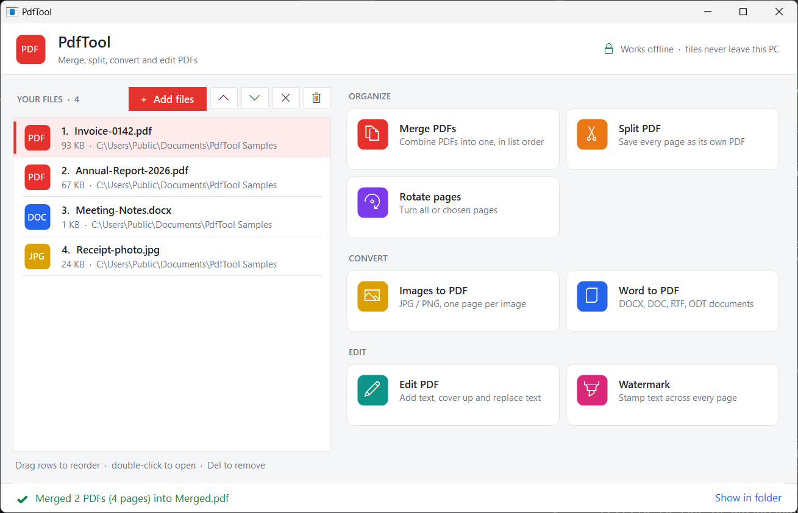
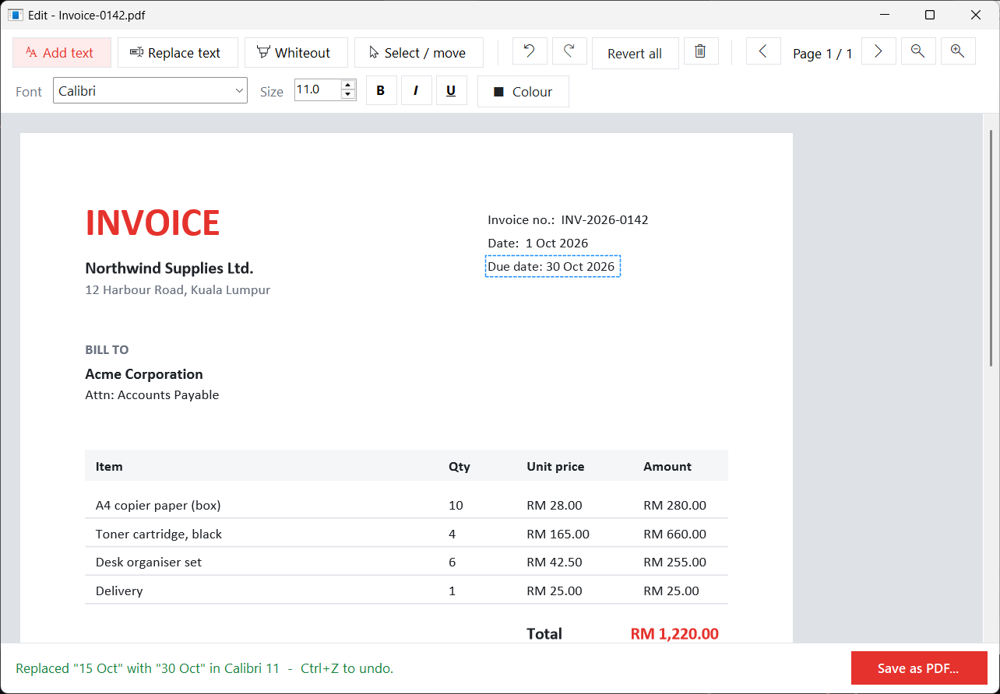
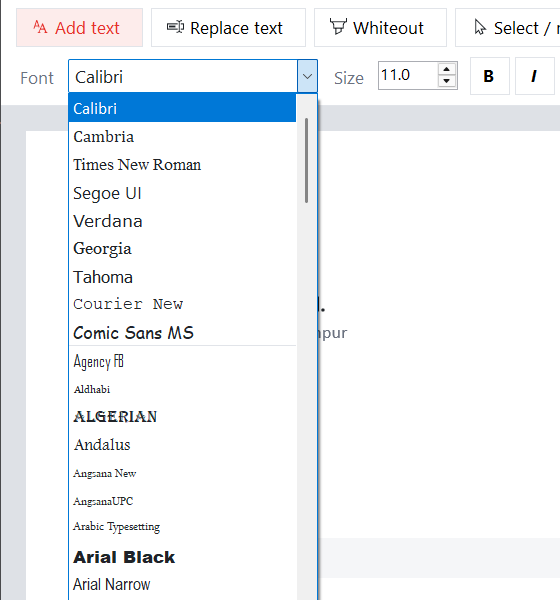
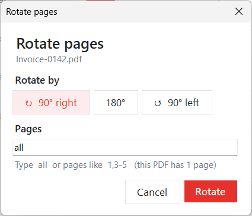

# PdfTool

**Merge, split, convert and edit PDFs on Windows — fully offline.**
No uploads, no accounts, no subscriptions: your files never leave your PC.

[](https://github.com/Messi10-newbie/PdfTool/releases/latest)
[](https://github.com/Messi10-newbie/PdfTool/actions/workflows/ci.yml)


[](LICENSE)



## Features

| | Tool | What it does |
|---|---|---|
| **Organize** | Merge PDFs | Combine PDFs in the order you choose (drag to reorder) |
| | Split PDF | Save every page as its own PDF |
| | Rotate pages | Rotate all pages or a range like `1,3-5` |
| **Convert** | Images to PDF | JPG / PNG → one page per image, page sized to the image |
| | Word to PDF | DOCX, DOC, RTF, ODT → PDF using the office suite already installed |
| **Edit** | Edit PDF | Add text, **replace existing text**, white-out content; any installed font, bold / italic / underline, colour; full undo / redo |
| | Watermark | Diagonal text across every page, auto-sized, adjustable opacity and colour |

Also: drag-and-drop, "Open with PdfTool" from Explorer, remembers your last folder,
works on rotated pages, and previews edits exactly as they will be saved.

### The editor

Drag a box over existing text, type the replacement, and it's swapped in place — here the
invoice due date was changed from *15 Oct* to *30 Oct* in the document's own font (Calibri).



<table>
  <tr>
    <td width="55%"></td>
    <td></td>
  </tr>
  <tr>
    <td>Every installed Windows font, previewed in its own typeface</td>
    <td>Simple option dialogs — rotate all pages or a range like <code>1,3-5</code></td>
  </tr>
</table>

## Install

**[⬇ Download the latest installer](https://github.com/Messi10-newbie/PdfTool/releases/latest)**
(`PdfTool-Setup-<version>.exe`) and run it — or grab the portable `.exe`, no install needed.
Requires 64-bit Windows 10 (1809) or Windows 11. .NET is bundled; nothing else to install.

Word → PDF needs Microsoft Word, WPS Office or LibreOffice installed.

## Build from source

Requirements: .NET 8 SDK (or newer), Windows 10/11.

```bash
git clone https://github.com/Messi10-newbie/PdfTool.git
cd PdfTool/PdfTool
dotnet run
```

Run the tests (from the repo root):

```bash
dotnet test
```

Build the installer (needs [Inno Setup 6](https://jrsoftware.org/isinfo.php)):

```bash
cd PdfTool
dotnet publish -c Release -o publish
iscc installer/PdfTool.iss        # -> installer/Output/PdfTool-Setup-<version>.exe
```

## Tech stack

- **C# / .NET 8, Windows Forms** — UI built entirely in code (no designer files)
- **[PDFsharp](https://github.com/empira/PDFsharp) 6.1** (MIT) — reading and writing PDFs
- **Windows.Data.Pdf** (built into Windows) — rendering pages in the editor
- **Inno Setup** — installer

## Interesting problems solved

- **Fonts:** out of the box PDFsharp could embed only 7 of the 349 fonts installed on Windows.
  A custom font resolver (`WindowsFontResolver.cs`) reads the Windows font registry and
  extracts individual fonts from `.ttc` collections — 281 fonts now work, including Calibri and Cambria.
- **Rotated pages:** edits landed off-page on PDFs with `/Rotate 90/270` because PDFsharp
  flips the y-axis using the swapped page height. `PdfEditWriter` compensates and maps
  "what you see" coordinates onto the unrotated page.
- **Word conversion via COM:** WPS Office registers itself as `Word.Application` and exits
  after every document; the converter detects the dead process and restarts it.
- **WYSIWYG editor:** screen preview and saved PDF share the same text layout code and
  match to within ~1 pixel at 200% zoom.

## For developers

Architecture, coding conventions, known pitfalls and the release process are in
**[docs/DEVELOPMENT.md](docs/DEVELOPMENT.md)**. Release history: [CHANGELOG.md](CHANGELOG.md).

## License

[MIT](LICENSE) © 2026 Deveswar Mohan
